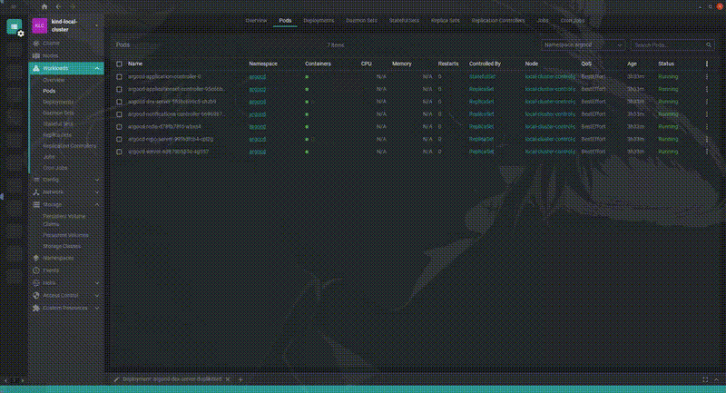

# Freelens Duplicate Extension

Don't debug in live workloads, duplicate instead.

A Freelens extension for duplicating Kubernetes resources using [duplik8s](https://github.com/Telemaco019/duplik8s).



## Requirements

- Freelens >= 1.5.2
- kubectl with duplik8s plugin installed

## Installation

1. Install duplik8s: `kubectl krew install duplicate`
2. Install this extension in Freelens Extensions page

`@omarluq/freelens-duplicate-extension`

## Usage

Right-click on a Pod, Deployment, or StatefulSet and select "Duplicate".

## Build

```bash
pnpm install
pnpm build
pnpm pack
```

## License

MIT

